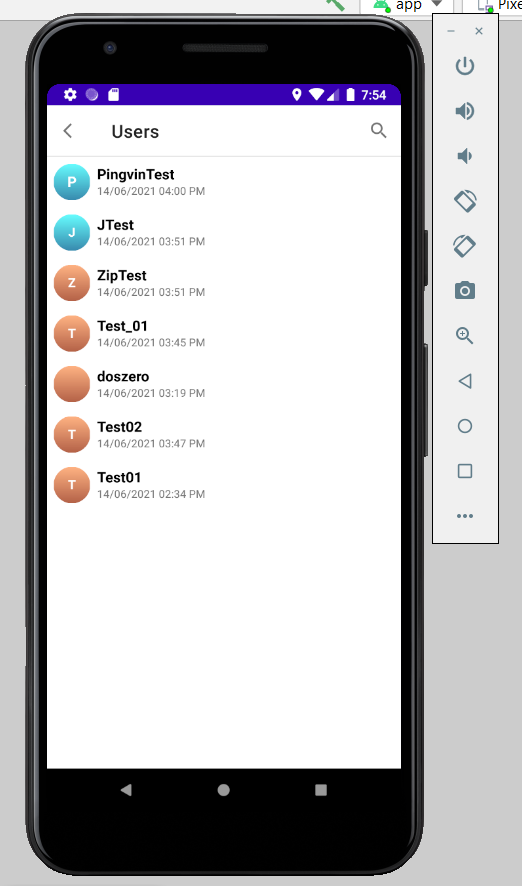
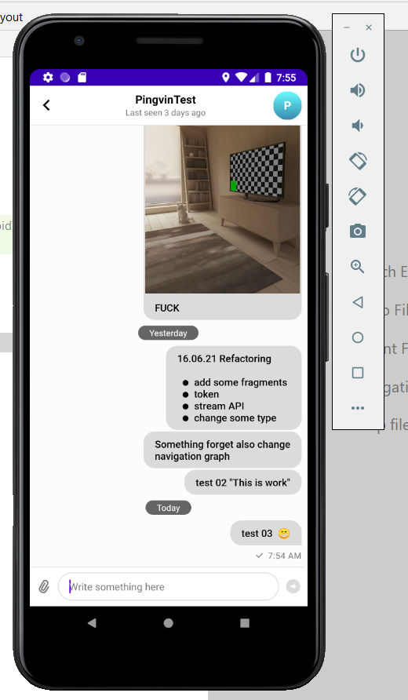
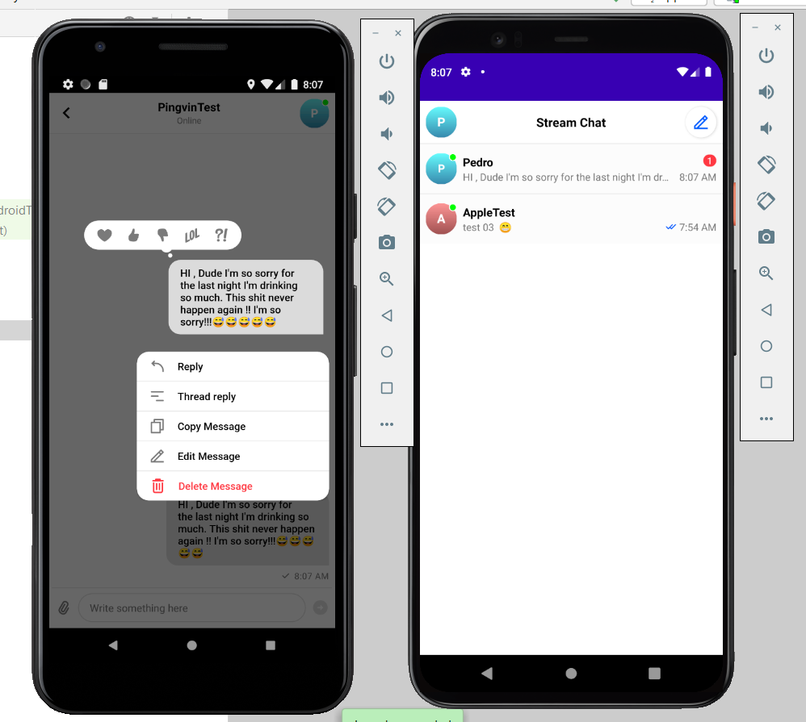
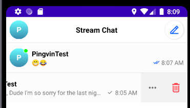
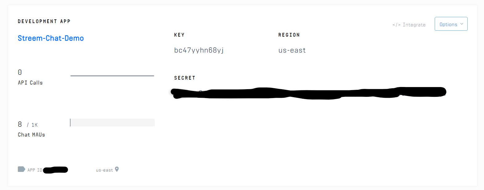

# Stream-Messenger
WhatsApp Clone on Android With Kotlin (Use some patterns)

# What is [Stream Chat](https://github.com/GetStream/stream-chat-android/blob/main/README.md) ? :alien:
Stream Chat, a service for building chat and messaging applications. This library includes both a low-level chat SDK and a set of reusable UI components. Most users start with the UI components, and fall back to the lower level API when they want to customize things.

# Using ✅
- Message List implementation
- MessageListView style and custom attachment type
- Typing Header component created with the Low-Level Client library

# Setup 
```
repositories {
    mavenCentral()
}

dependencies {
    implementation "io.getstream:stream-chat-android-client:$stream_version"
}
```
# Useful links :dizzy: :
* 1)https://getstream.io/blog/build-whatsapp-clone/
* 2)https://getstream.io/tutorials/android-chat/#congratulations
* 3)https://getstream.io/chat/docs/android/?language=kotlin
* 4)https://github.com/GetStream

# Screenshots 
<p align="center">

</p>

<p align="center">

</p>




<p align="center">

</p>



# Use test acc to examine apk 
AppleTest 
# !! Registered yours Stream account and change KEY , if app will be disconnected
